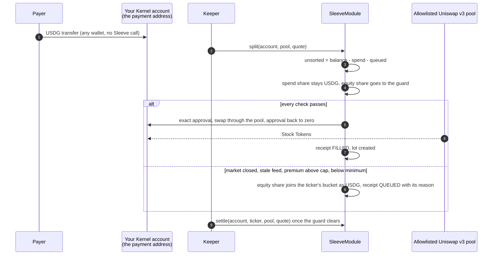
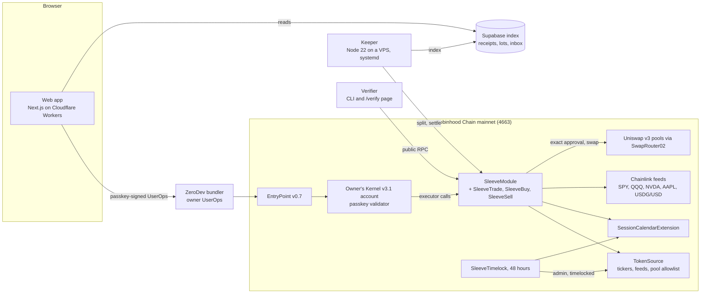

<p>
  <picture>
    <source media="(prefers-color-scheme: dark)" srcset="app/public/brand/sleeve-lockup-horizontal-reversed.svg">
    
  </picture>
</p>

# Sleeve

A payment address on Robinhood Chain that invests part of every payment.

You get paid in USDG. Sleeve splits each payment by a rule you set once: the spend share stays USDG and ready to use, and the equity share buys a US Stock Token (SPY, QQQ, NVDA or AAPL) into your own smart account. When the market is closed, or the pool's price sits further above the Chainlink reference than your cap allows, the equity share waits as USDG in the same account and buys when the guard clears. Every action writes a receipt that anyone can recompute from public chain data.

**[Open the app](https://trysleeve.xyz)** · **[Verify a receipt](https://trysleeve.xyz/verify)** · **[SleeveModule on Blockscout](https://robinhoodchain.blockscout.com/address/0x15FA6775fCdB5904aA673967461dc1fA3c6E7Ac9)** · **[Deployment record](docs/DEPLOYMENTS.md)** · **[Security](SECURITY.md)**

> Stock Tokens are debt securities issued by Robinhood Assets (Jersey) Limited. They are not shares and carry no shareholder rights. Sleeve is not affiliated with, endorsed by, or officially connected with Robinhood Markets, Inc. Sleeve shows the issuer's own disclosure word for word, pinned by hash ([docs/disclosure](docs/disclosure/README.md)).

## Contents

- [Status](#status)
- [Why Sleeve](#why-sleeve)
- [How a payday splits](#how-a-payday-splits)
- [The guard](#the-guard)
- [Receipts and the verifier](#receipts-and-the-verifier)
- [Architecture](#architecture)
- [Deployed contracts](#deployed-contracts)
- [Evidence](#evidence)
- [Security model](#security-model)
- [Run it yourself](#run-it-yourself)
- [Repository map](#repository-map)
- [Documentation](#documentation)
- [What Sleeve does not do yet](#what-sleeve-does-not-do-yet)

## Status

Checked on 4 October 2026. Every row links to the evidence a reviewer can check or rerun.

| Part | State | Evidence |
| --- | --- | --- |
| Contracts | Live on Robinhood Chain mainnet (chain id 4663) since 3 October 2026, blocks 79,338,287 to 79,338,373. All seven verified on Sourcify with an exact match for runtime and creation code, and read back from chain state with every check passing | [docs/DEPLOYMENTS.md](docs/DEPLOYMENTS.md), `contracts/script/ReadBack.s.sol` |
| Web app | Live at [trysleeve.xyz](https://trysleeve.xyz) with every M0 screen wired to the chain: passkey sign-up, rule editor, sleeves, payments inbox, receipts, share cards, sell-back, a waitlist, light and dark themes. The first mainnet sign-up comes with HP1 | `app/`, [D-033](docs/DECISIONS.md) |
| Keeper | Live since 4 October 2026 on a VPS under systemd. It indexes the module from its deploy block into Supabase and will split and settle as payments arrive. The site's index endpoint shows its cursor: [/api/index](https://trysleeve.xyz/api/index?view=receipts&account=0x0000000000000000000000000000000000000001) | `keeper/`, [keeper/deploy/README.md](keeper/deploy/README.md) |
| Verifier | Built: a CLI and a web page that recompute any receipt from chain data through the public RPC, a different provider from the keeper's | `packages/verifier/`, [/verify](https://trysleeve.xyz/verify) |
| Gas sponsorship | **Configured.** A ZeroDev gas policy for Robinhood Chain covers owner UserOps up to a daily and a per-operation cap, and a prepare-only request for a new account's first UserOp came back sponsored, with nothing sent. No owner action has run on mainnet yet (claim 6.9) | [docs/DEPLOYMENTS.md](docs/DEPLOYMENTS.md) |
| HP1, live payments | **Pending.** No Sleeve account or receipt exists on mainnet yet. The campaign is at least 10 real payments from at least 3 payers, one of them off-hours, each receipt verified | [docs/CLAIM_LEDGER.md](docs/CLAIM_LEDGER.md) |
| HP2, price replay | **Provisional pass.** Guarded buying beat buying at arrival by 309.11 bps pooled over 1,000 replayed payments. Provisional until the pre-registered rerun on a second provider runs | [docs/HP2_RESULTS.md](docs/HP2_RESULTS.md) |
| HP3, security | 852 Foundry tests (unit, fork at pinned blocks, stateful invariants, audit regressions), 1,681 TypeScript tests, an internal audit round with 43 findings, Slither and Aderyn triaged | [SECURITY.md](SECURITY.md) |

Nothing in this README describes a live payment, fill or queue on mainnet as done. Those arrive with HP1, and [docs/CLAIM_LEDGER.md](docs/CLAIM_LEDGER.md) lists which claims Sleeve may make and with what evidence.

## Why Sleeve

People outside the US who are paid in stablecoins, starting with freelancers in Lagos, can already buy US Stock Tokens: Robinhood offers them to eligible users in about [120 countries](https://securitybrief.co.uk/story/robinhood-launches-chain-stock-tokens-in-120-countries). Access is solved. What is not solved is the habit. Buying by hand every payday is a fresh decision each time, and it keeps getting put off.

Sleeve moves the decision to setup. The payment address itself does the investing: you set the split once, and every payment that lands is sorted with no step from you. Research on automatic enrollment ([Madrian and Shea 2001](https://www.nber.org/papers/w7682)) shows how much a default shapes what people end up saving. Sleeve is set up by the earner rather than an employer, so it borrows the idea of a set-once default and claims no participation rate from that research.

Three things make that safe to automate on this chain:

- **Waiting is cheap and buying blind is not.** Stock Token feeds hold their last price off-hours, and some pools trade far from the underlying. Sleeve buys only when the market is open and the measured all-in price sits within your cap of the Chainlink reference; otherwise the money waits as USDG in your own account. The replay below measures what that discipline is worth.
- **Your money never leaves your account.** The module is an ERC-7579 executor installed on your own Kernel smart account. It holds no funds, it can only buy through allowlisted pools with exact approvals reset to zero in the same call, and you can withdraw, release, transfer or uninstall without the keeper or the app.
- **Every action is checkable.** Each split, settle, release and sell writes a receipt event and stores its hash onchain. The verifier recomputes every field from chain data through a different RPC provider from the keeper's.

Eligibility follows the issuer's own list: the offer is restricted in the US, Canada, the UK and Switzerland and prohibited in eleven further jurisdictions; Nigeria is on neither list ([source](https://docs.robinhood.com/rhj/restricted-jurisdictions), saved in `docs/disclosure/`). Onboarding asks for the residency attestation and checks the request's country.

## How a payday splits



1. **Sign up with a passkey.** The app deploys your ERC-7579 smart account (ZeroDev Kernel v3.1 on EntryPoint v0.7) with the passkey as its root validator and the Sleeve module installed. The account address is your payment address. Owner actions go through ZeroDev's bundler under a capped gas policy (claim 6.9, pending until an owner action runs on mainnet), and if the policy declines one, you pay its gas in ETH after a confirmation.
2. **Set the rule once.** The share of each payment that buys, the ticker, a premium cap against the Chainlink reference, a slippage cap and a minimum buy size. The suggested start in `packages/core/src/rule.ts` is 10 percent to SPY with a 100 bps premium cap, 50 bps slippage and a 25 USDG minimum.
3. **Get paid.** Anyone sends USDG to the address from any wallet. An ERC-20 transfer does not call the receiving account, so the module sorts by balance accounting: income is the USDG that is neither spend nor queued.
4. **The keeper splits it.** It polls every few seconds and calls `split`. If the keeper is down, anyone can call `observe` and then `split` after a one-hour grace, and the owner can always trigger it directly.
5. **The equity share buys or waits.** A fill lands Stock Tokens in your account and creates a lot. A wait adds the USDG to the ticker's bucket with a reason, and `settle` buys it once the guard clears. You can `release` a bucket to spend at any time, and `sell` turns lots back into USDG.
6. **Your own USDG is never split.** Owner batches run inside `beginOwnerOp` and `endOwnerOp` brackets, so top-ups, sale proceeds and anything else you move are booked as your money, not income (I6, I14). The installation snapshot does the same for the balance you already held (I5).

## The guard

`split` and `settle` run the guard on the rule's ticker. The first failing check wins ([docs/SPEC.md](docs/SPEC.md) sections 4, 9 and 10).

| Check | On failure |
| --- | --- |
| Ticker active, with a Chainlink feed and a non-empty pool allowlist (TokenSource) | `REFUSED_TICKER`: the equity share goes to spend |
| Account not on the token's blocklist (the token's beacon `isBlocked`) | `REFUSED_ACCOUNT`: the equity share goes to spend |
| Token not paused, and the issuer's `oraclePaused()` flag clear | Queue `PAUSED` or `ORACLE_PAUSED` |
| Market session open, from the onchain `SessionCalendar`: the 24/5 US Eastern schedule with precomputed daylight-saving dates and the NYSE holidays for 2026 and 2027 | Queue `SESSION` |
| No pending corporate-action multiplier | Queue `MULTIPLIER` |
| Feed fresh: a positive answer within its age limit, and after a reopen a round newer than the open | Queue `STALE` |
| USDG at its peg on the USDG/USD feed | Queue `DEPEG` |
| Equity share at or above the rule's minimum | Queue `CLIP` |
| All-in premium within the cap, measured from the balances that left and entered the account against the Chainlink answer | Queue `PREMIUM` (the swap is undone) |

Why each check exists: Stock Token feeds have a 24-hour heartbeat and a 0.5 percent deviation trigger and hold the last price off-hours, so feed age cannot tell a Saturday from a quiet Tuesday; the calendar can. Each Stock Token has many pools, some with extreme fee tiers and some that take fees inside Uniswap v4 hooks, so Sleeve buys only through allowlisted v3 pools and measures the price from balances instead of trusting a quote. Stock Tokens are beacon proxies whose beacon holds a pause flag and a blocklist, so both are read before a buy. These findings are recorded in [docs/research/](docs/research/README.md) and [docs/DECISIONS.md](docs/DECISIONS.md).

## Receipts and the verifier

Every module action emits `ReceiptWritten(id, account, status, receipt)` and stores `keccak256(abi.encode(receipt))` onchain, append-only (I7). A receipt carries what arrived (`usdgIn`), what stayed spendable, what bought or waited, the tokens received, the execution price and the premium against the reference, the Chainlink round used (id, answer, updatedAt) and the USDG/USD round, the pool and minimum out, the calendar version, the issuer disclosure hash, the L2 block from ArbSys and the timestamp. Statuses: `FILLED`, `QUEUED`, `SETTLED`, `RELEASED`, `REFUSED_TICKER`, `REFUSED_ACCOUNT`, `PART_SOLD`, `SOLD`, `RECONCILED`. The full struct is in [docs/SPEC.md](docs/SPEC.md) section 13.

The verifier recomputes a receipt from public chain data and compares every field and the stored hash:

```bash
pnpm install
pnpm --filter @sleeve/verifier build
node packages/verifier/bin/sleeve.js verify <receiptId>            # through https://rpc.mainnet.chain.robinhood.com
node packages/verifier/bin/sleeve.js verify <receiptId> --json     # machine-readable result
node packages/verifier/bin/sleeve.js verify <receiptId> --rpc <url>
```

The same checks run in the browser at [trysleeve.xyz/verify](https://trysleeve.xyz/verify). The verifier reads through the public Robinhood Chain RPC on purpose, so it never shares a provider with the keeper. Mainnet receipts start with HP1; until then the verifier is exercised by its 158 tests and a fork suite on anvil (`pnpm --filter @sleeve/verifier test:fork`).

## Architecture



| Component | What it is | Where |
| --- | --- | --- |
| SleeveModule | ERC-7579 executor: install snapshot, rules, owner brackets, split, settle, release, sell-back, lots and receipts. Not upgradeable. Delegates the heavy paths to three linked libraries | `contracts/src/` |
| LedgerMath | Pure library: unsorted equals balance minus spend minus pending; outflows apply to spend, then unsorted, then pending; splits in basis points with dust to spend | `contracts/src/libraries/` |
| SessionCalendar | Pure library and a timelocked extension: market sessions per ticker type, daylight-saving switches and holidays for 2026 and 2027 | `contracts/src/libraries/`, `contracts/src/SessionCalendarExtension.sol` |
| PriceGuard | Feed answer and age, pause flags, blocklist, multiplier, USDG peg and the premium from measured balances | `contracts/src/libraries/` |
| TokenSource | Mirror of the four launch tickers with their tokens, feeds, session types and allowlisted pools. Its admin can remove, never add a ticker, behind the 48-hour timelock | `contracts/src/` |
| Keeper | Polls every 5 seconds, indexes receipts and inbound transfers into Supabase, calls split and settle, holds sorting while gas is above its ceiling until a payment has waited 24 hours, serves a private health report | `keeper/` |
| Verifier | Recomputes receipts from logs, balances and feed rounds through the public RPC | `packages/verifier/` |
| Web app | Passkey onboarding, rule editor, sleeves, inbox, receipts, share cards, sell-back, eligibility gate, both themes | `app/` |
| Shared core | Types, constants, rule limits, premium math and formatting used by the app, keeper and verifier | `packages/core/` |

Hosting choices and why: [D-033](docs/DECISIONS.md) (Cloudflare Workers for the app), [D-035](docs/DECISIONS.md) (which RPC serves which read), [D-036](docs/DECISIONS.md) (the keeper's VPS).

## Deployed contracts

Robinhood Chain mainnet, chain id 4663, deployed 3 October 2026 from commit `ca795ff` with a clean tree. Seven transactions, 18,410,544 gas, 0.000423594 ETH.

| Contract | Address |
| --- | --- |
| SleeveModule | [0x15FA6775fCdB5904aA673967461dc1fA3c6E7Ac9](https://robinhoodchain.blockscout.com/address/0x15FA6775fCdB5904aA673967461dc1fA3c6E7Ac9) |
| TokenSource | [0x6643a2F99534c90a68E6eCE707c7bFA6D5b0975F](https://robinhoodchain.blockscout.com/address/0x6643a2F99534c90a68E6eCE707c7bFA6D5b0975F) |
| SleeveTimelock | [0x0088C481C56b7B2407C6a981BAc3da0CC0Fc5b2D](https://robinhoodchain.blockscout.com/address/0x0088C481C56b7B2407C6a981BAc3da0CC0Fc5b2D) |
| SessionCalendarExtension | [0xa7a3C55309E5FB2Fb61eeA6F6e2318CF927b247D](https://robinhoodchain.blockscout.com/address/0xa7a3C55309E5FB2Fb61eeA6F6e2318CF927b247D) |
| SleeveTrade (library) | [0x3757964A25C94040e81a215Dd85B748f6bB9ca84](https://robinhoodchain.blockscout.com/address/0x3757964A25C94040e81a215Dd85B748f6bB9ca84) |
| SleeveBuy (library) | [0xDF3e060D64086ec3309265Ce83B34813eE45F81A](https://robinhoodchain.blockscout.com/address/0xDF3e060D64086ec3309265Ce83B34813eE45F81A) |
| SleeveSell (library) | [0xC0003635086E51aC0c19c40c193043D58d86c987](https://robinhoodchain.blockscout.com/address/0xC0003635086E51aC0c19c40c193043D58d86c987) |

Source: Sourcify exact match for every contract (links in [docs/DEPLOYMENTS.md](docs/DEPLOYMENTS.md)). The module's default keeper is `0x8649275ca7ce63d2F9E6487570ec0DCe14b6Bf46`, an immutable constructor value. The full record, with constructor arguments, library links, block hashes and costs, is `contracts/deployments/4663.json`, and `contracts/script/verify.py` rebuilds every verification input from this checkout.

## Evidence

**HP2, price discipline (provisional pass).** A replay under a protocol pre-registered before any data was fetched ([docs/HP2_PROTOCOL.md](docs/HP2_PROTOCOL.md)): 1,000 payments of 100 USDG, 250 per ticker, arriving uniformly over each ticker's window, priced from real pool quotes and Chainlink rounds. Buying at arrival paid a pooled mean of 309.11 bps more over the reference than Sleeve's guarded policy, with a 95 percent bootstrap interval of 209.24 to 419.12 bps, and the guarded policy's median delay was 0.00 hours. Almost all of the gap is SPY's pool launching at about twice the reference price; the other 934 payments paid about 1.66 bps each to wait. A third policy with the feed removed shows what the Chainlink check adds over the calendar alone. Provisional because the protocol's rerun on a second provider has not run. Rerun with `scripts/hp2/.venv/bin/python scripts/hp2/run.py` ([docs/HP2_RESULTS.md](docs/HP2_RESULTS.md), [D-020](docs/DECISIONS.md)).

**HP1, live payments (pending).** At least 10 real payments from at least 3 payers on mainnet, at least one off-hours, every receipt verified on a separate RPC. Receipt ids and links will be listed here when they exist.

**HP3, security.** See [SECURITY.md](SECURITY.md): the invariant map I1 to I14 with the tests behind each, fork tests against the real USDG pools, Stock Tokens and feeds at pinned blocks, the audit round and the static analysis triage.

**Gas, measured on a fork** at block 78,312,136 with `forge test --isolate` ([docs/GAS.md](docs/GAS.md)): a keeper split that fills on SPY uses about 544,000 gas and a settle about 522,000; an owner UserOp uses 376,000 to 768,000. At the 0.0316 gwei gas price recorded in [docs/FUNDING.md](docs/FUNDING.md), a fill costs 0.0000172 ETH. Mainnet figures will come from HP1 receipts.

## Security model

The short version; the full model is in [SECURITY.md](SECURITY.md).

- **Non-custodial.** Funds stay in the owner's account. The module holds nothing after any call, checked as a delta of its own balances around every swap (I1).
- **Narrow keeper.** The keeper key can only call the public `split` and `settle` on accounts that name it, early and without the grace. It cannot move funds out of an account, and every buy it triggers is bounded by the owner's rule and caps.
- **Owner exits without anyone else.** Withdraw, release, transfer and uninstall work without the keeper or the app (I11, fork tests through `handleOps`, with the root key and through a recovery signer on a passkey account).
- **Exact approvals.** The account approves the exact input for one swap and resets the allowance to zero in the same call. There are no standing approvals (I4).
- **Admin cannot touch funds.** The timelock administers only TokenSource and the calendar, behind a 48-hour delay. Through it TokenSource can remove a ticker and allow or remove a pool, and can never add a ticker (I10).
- **Scoped claim.** Exact income sorting holds for actions taken through Sleeve. An action signed outside Sleeve can make owner money look like income; receipts carry the accounting mode, and non-custody holds either way.

## Run it yourself

Requirements: Foundry 1.7, Node 22.12 or later, pnpm 11, and Python 3.11 for the HP2 harness.

```bash
git clone --recurse-submodules <this repo>
cd sleeve
pnpm install

# TypeScript: app, keeper, verifier, shared core (1,681 tests)
pnpm typecheck && pnpm test && pnpm lint

# Contracts: unit, audit and invariant suites (673 tests, a few of which fork mainnet through a public RPC by default)
cd contracts
forge test --no-match-path "test/{fork,spike}/*"

# Fork tests pin blocks on Robinhood Chain mainnet and need an archive RPC,
# because the public RPC keeps only minutes of state (D-008)
FORK_RPC=https://robinhood.drpc.org forge test --match-path "test/fork/*"
```

Run the app locally on labelled sample data:

```bash
cp .env.example .env.local          # NEXT_PUBLIC_SLEEVE_DATA_SOURCE=mock by default
ln -s ../.env.local app/.env.local  # the app reads the root file through this link
pnpm --filter @sleeve/app dev       # http://localhost:3000
```

Set `NEXT_PUBLIC_SLEEVE_DATA_SOURCE=chain` to read Robinhood Chain mainnet instead. Passkey sign-up needs a ZeroDev project and a relying party id that matches the origin; `.env.example` explains each variable. The keeper's local run and its VPS install are in [keeper/README.md](keeper/README.md) and [keeper/deploy/README.md](keeper/deploy/README.md).

## Repository map

| Path | What it holds |
| --- | --- |
| `contracts/` | Foundry project: SleeveModule and its libraries, TokenSource, SleeveTimelock, SessionCalendar, PriceGuard, LedgerMath; tests in `test/unit`, `test/fork`, `test/invariant`, `test/audit` and the G6 account-stack spike in `test/spike`; deploy, read-back and verification scripts; the deployment record |
| `keeper/` | The keeper service, its tests and its systemd deploy kit |
| `packages/verifier/` | The receipt verifier and the `sleeve verify` CLI |
| `packages/core/` | Shared types, constants, rule limits and premium math |
| `app/` | The Next.js web app and its Cloudflare deploy script |
| `supabase/` | Schema migration for the receipt index, passkey credential records and share cards |
| `scripts/` | HP2 replay harness, calendar and premium vector generators, copy lint, secret scan |
| `results/` | HP2 replay inputs and outputs |
| `docs/` | Spec, decisions, gates, deployments, claims, audit, gas, design, research |

## Documentation

| Document | What it answers |
| --- | --- |
| [docs/THESIS.md](docs/THESIS.md) | Who Sleeve is for, the problem it solves, how it works and what is measured so far |
| [docs/SPEC.md](docs/SPEC.md) | Exactly what each contract function does, its errors, receipts and the invariant map |
| [docs/DECISIONS.md](docs/DECISIONS.md) | Every design choice a reviewer would question, D-001 to D-039 |
| [docs/GATES.md](docs/GATES.md) | The open questions that gate features (borrow, pay link, registry) and the account-stack gate G6 that passed |
| [docs/DEPLOYMENTS.md](docs/DEPLOYMENTS.md) | Mainnet addresses, transactions, verification, read-back, and the live app, keeper and endpoints |
| [docs/CLAIM_LEDGER.md](docs/CLAIM_LEDGER.md) | Every claim Sleeve may make, its status and evidence, and the claims it never makes |
| [SECURITY.md](SECURITY.md) | Threat model, invariants, tests, audit and static analysis |
| [docs/audit/AUDIT_R1.md](docs/audit/AUDIT_R1.md) | The internal audit round: 43 findings and what happened to each |
| [docs/STATIC_ANALYSIS.md](docs/STATIC_ANALYSIS.md) | Every Slither and Aderyn result with its triage |
| [docs/HP2_PROTOCOL.md](docs/HP2_PROTOCOL.md), [docs/HP2_RESULTS.md](docs/HP2_RESULTS.md) | The pre-registered replay and its results |
| [docs/GAS.md](docs/GAS.md) | Measured gas per call on a fork |
| [docs/EVAL_CAMPAIGN.md](docs/EVAL_CAMPAIGN.md) | The HP1 plan: real payments from distinct payers, step by step, and the results tables it fills |
| [docs/DEMO_SCRIPT.md](docs/DEMO_SCRIPT.md) | The demo video's shots and voice-over, with the ledger row behind each line |
| [docs/DESIGN.md](docs/DESIGN.md) | The design system, both themes and the copy rules |
| [SPONSOR_FINDINGS.md](SPONSOR_FINDINGS.md) | What building on Robinhood Chain, its Stock Tokens, Chainlink, Uniswap and ZeroDev turned up, and how each finding was checked |
| [CONTRIBUTIONS.md](CONTRIBUTIONS.md) | Issues found in Robinhood Chain, issuer and integration docs while building, drafted for upstream |
| [docs/research/](docs/research/README.md) | Dated research notes behind the decisions: chain constants, pools, the session calendar, the issuer disclosure, the passkey stack |
| [docs/PROGRESS.md](docs/PROGRESS.md) | The build log |

## What Sleeve does not do yet

These stay out of the product until their gate closes or their milestone ships, and no screen or demo presents them as live.

| Feature | Why it waits |
| --- | --- |
| Borrow against Stock Tokens | Gate G1: markets exist on Morpho, none is vetted ([docs/GATES.md](docs/GATES.md)) |
| Cross-chain pay link (USDC or USDT in from Arbitrum One) | Gate G2: routes are quoted, nothing has been sent |
| Onchain asset registry read | Gate G3: no registry contract address is published; TokenSource mirrors the canonical list instead |
| Same-chain pay link, baskets, crews | Milestone M1 |
| Email login | Milestone M1; passkey is the only M0 login |
| EIP-7702 accounts | After M0: a 7702 account's key can send around the module and break exact income accounting |

Sleeve never claims best execution, yield, or a participation rate from retirement-plan research, and never calls a Stock Token a share.

## License

MIT. See [LICENSE](LICENSE).
